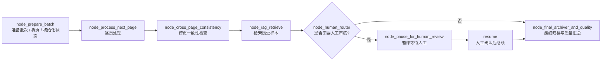
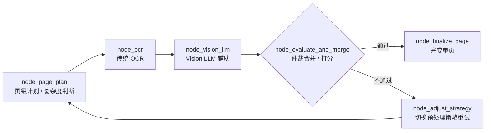

# LangGraph 简化流转图

这份图不是给框架看的，是给人看的。  
如果你觉得 LangSmith / LangGraph 原生 trace 太绕，先看这张，再回去看节点树。

## 整份文件主流程

## 单页处理子流程

## 你最该看的 4 个节点

- `node_ocr`
  这里看 OCR 是否真正读到了字，是否有图片路径、版面解析、预处理问题。
- `node_vision_llm`
  这里看大模型有没有参与、返回内容是不是脏格式、有没有超时。
- `node_evaluate_and_merge`
  这里看最终 `confidence`、`issues`、`human_review`。
- `node_human_router`
  这里看为什么任务被暂停给人工，重点看 `review_reason`。

## 本地查看入口

启动 LangGraph Studio 本地服务后，可以直接打开：

- [http://127.0.0.1:8123/studio/flow](http://127.0.0.1:8123/studio/flow)

对应代码：

- [`app/studio/webapp.py`](/D:/Code/work/OCR-WEB-main/app/studio/webapp.py)
- [`app/services/agent_ocr_workflow.py`](/D:/Code/work/OCR-WEB-main/app/services/agent_ocr_workflow.py)
